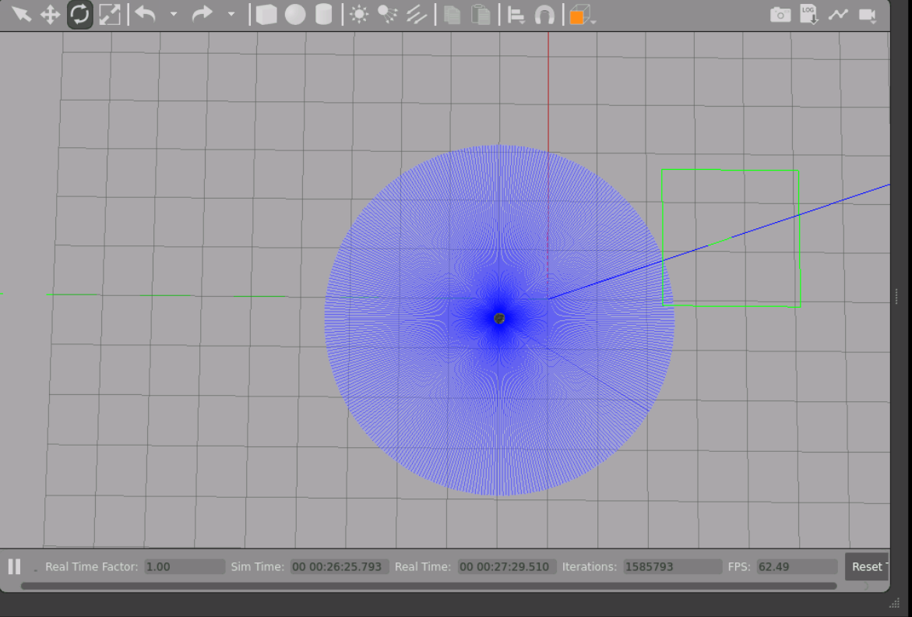
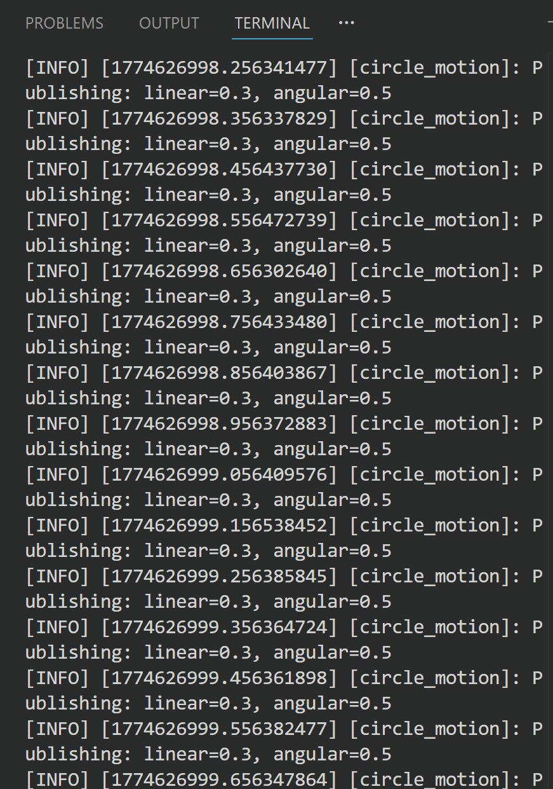
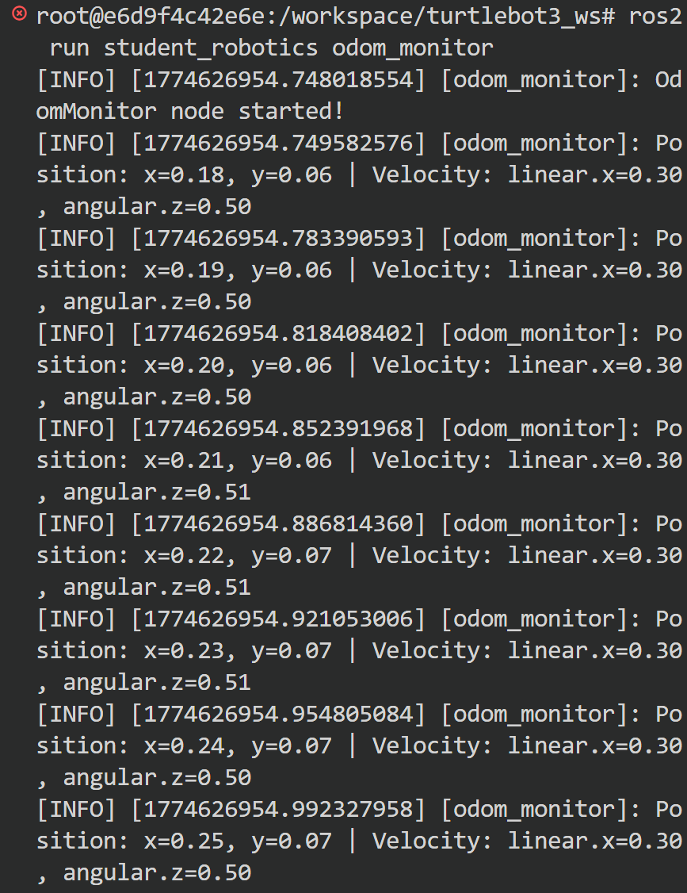
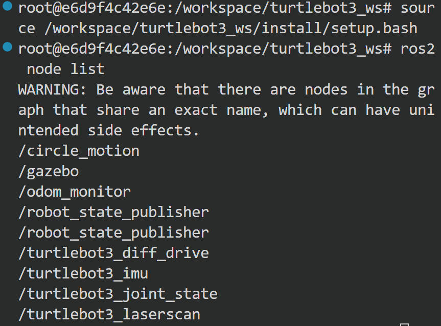
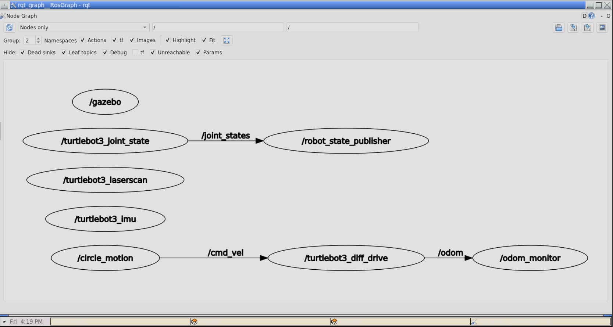

# Übungsblatt 06: ROS 2 Fundamentals – Topics, Nodes & Communication

**Repository:** https://github.com/MateoLopez00/lecture6-ros2demo  
**Name:** Mateo Lopez Ledezma  
**ROS2 Version:** Humble  

---

## Aufgabe 1a: Package Creation & Circle Motion Publisher

### Package Structure

```bash
ros2 pkg create --build-type ament_python student_robotics
```

.png)

### circle_motion.py

```python
#!/usr/bin/env python3
import rclpy
from rclpy.node import Node
from geometry_msgs.msg import Twist

class CircleMotion(Node):
    def __init__(self):
        super().__init__('circle_motion')
        self.publisher = self.create_publisher(Twist, '/cmd_vel', 10)
        self.timer = self.create_timer(0.1, self.publish_velocity)  # 10 Hz
        self.get_logger().info('CircleMotion node started!')

    def publish_velocity(self):
        msg = Twist()
        msg.linear.x = 0.3   # 0.3 m/s forward
        msg.angular.z = 0.5  # 0.5 rad/s turn
        self.publisher.publish(msg)
        self.get_logger().info(f'Publishing: linear={msg.linear.x}, angular={msg.angular.z}')

def main(args=None):
    rclpy.init(args=args)
    node = CircleMotion()
    rclpy.spin(node)
    rclpy.shutdown()

if __name__ == '__main__':
    main()
```

### Robot Moving in Circles in Gazebo



### Why use `create_timer()`?

`create_timer()` schedules a callback to run at a fixed frequency (10 Hz = every 0.1 seconds) without blocking the node's execution. This ensures the robot receives velocity commands at a predictable and consistent rate, which is essential for smooth and stable motion control.

---

## Aufgabe 1b: Odometry Subscriber

### odom_monitor.py

```python
#!/usr/bin/env python3
import rclpy
from rclpy.node import Node
from nav_msgs.msg import Odometry

class OdomMonitor(Node):
    def __init__(self):
        super().__init__('odom_monitor')
        self.subscription = self.create_subscription(
            Odometry, '/odom', self.odom_callback, 10)
        self.get_logger().info('OdomMonitor node started!')

    def odom_callback(self, msg):
        x = msg.pose.pose.position.x
        y = msg.pose.pose.position.y
        vx = msg.twist.twist.linear.x
        vz = msg.twist.twist.angular.z
        self.get_logger().info(
            f'Position: x={x:.2f}, y={y:.2f} | Velocity: linear.x={vx:.2f}, angular.z={vz:.2f}')

def main(args=None):
    rclpy.init(args=args)
    node = OdomMonitor()
    rclpy.spin(node)
    rclpy.shutdown()

if __name__ == '__main__':
    main()
```

### Both Nodes Running

**circle_motion output:**



**odom_monitor output:**



### ros2 node list (both nodes active)



### How does pub-sub decoupling work?

The publisher (`circle_motion`) and subscriber (`odom_monitor`) have no direct knowledge of each other — they only interact through named topics (`/cmd_vel` and `/odom`). The ROS2 middleware handles routing messages between any number of publishers and subscribers automatically, without either side needing to know who is on the other end. This means either node can be stopped, restarted, or replaced independently without affecting the other node's operation.

---

## Aufgabe 2a: ROS2 Topic Inspection & Message Frequency Analysis

### ros2 topic list


### ros2 topic info /cmd_vel


### ros2 topic info /odom


### ros2 topic hz /odom


### ros2 topic bw /odom


### ros2 node list


### ros2 node info /circle_motion


### Answers

**What is the /odom frequency? Why does it matter?**  
The `/odom` topic publishes at approximately **29.38 Hz** as shown by `ros2 topic hz /odom`. Frequency matters for robot control because a higher update rate gives the control system more position data per second, allowing it to react faster and more accurately to movement changes. If the frequency were too low, the robot's control loop would be working with stale position data, leading to imprecise or unstable navigation.

**How many publishers and subscribers does /cmd_vel have?**  
When both nodes are running, `/cmd_vel` has **1 publisher** and **1 subscriber**:
- Publisher: `/circle_motion` (our node sending velocity commands)
- Subscriber: `/turtlebot3_diff_drive` (the TurtleBot3 Gazebo plugin consuming the commands)

**What is the difference between `ros2 topic hz` and `ros2 topic bw`?**  
`ros2 topic hz` measures the message publishing frequency in messages per second (Hz), indicating how often data is being sent. `ros2 topic bw` measures the bandwidth in bytes per second, indicating how much data is being transmitted — it reflects both frequency and message size combined.

---

## Aufgabe 2b: Visualize Communication Graph

### rqt_graph

```bash
rqt_graph
```



### What does the graph show?

The graph shows all active ROS2 nodes as ovals and the topics connecting them as labeled arrows. `/circle_motion` publishes to `/cmd_vel`, which is consumed by `/turtlebot3_diff_drive`, which in turn publishes to `/odom`, which is consumed by `/odom_monitor` — forming the complete data flow chain from velocity command to odometry feedback.

**What happens if you stop circle_motion? Does odom_monitor still work?**  
If `circle_motion` is stopped, the robot stops moving but `odom_monitor` continues to work normally. This is because `odom_monitor` subscribes to `/odom`, which is published by the TurtleBot3 simulation plugin independently of `circle_motion` — it will simply show zero velocity and a static position until the robot moves again.

---

## Commands Used

```bash
# Package creation
ros2 pkg create --build-type ament_python student_robotics

# Build
cd /workspace/turtlebot3_ws
colcon build --packages-select student_robotics
source install/setup.bash

# Launch simulation
tb3_empty

# Run nodes
ros2 run student_robotics circle_motion
ros2 run student_robotics odom_monitor

# Topic inspection
ros2 topic list
ros2 topic info /cmd_vel
ros2 topic info /odom
ros2 topic hz /odom
ros2 topic bw /odom
ros2 node list
ros2 node info /circle_motion
rqt_graph
```
